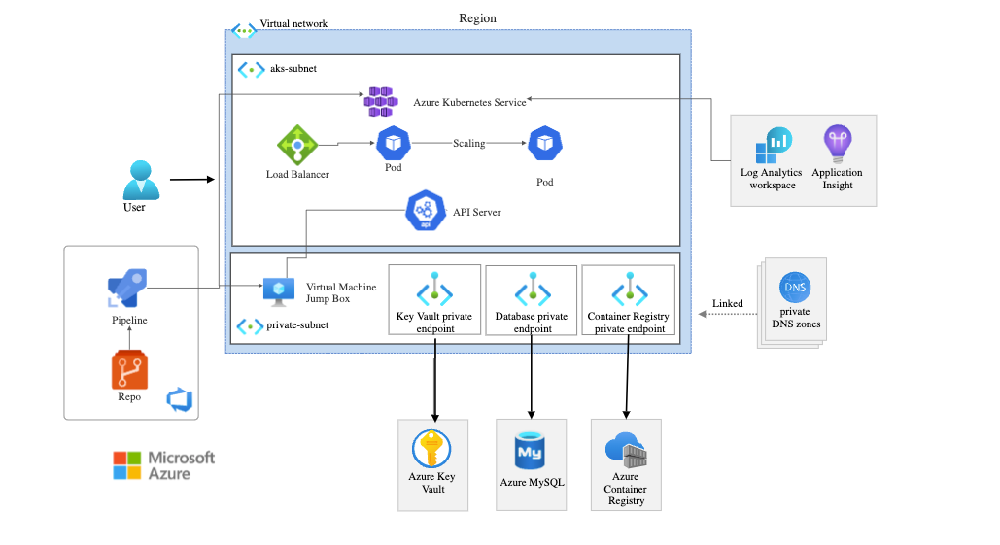

## Description
- This is a sample Node.js Restful CRUD API which uses Express as web framework and MySQL as database.
- with 
- Azure Kubernetes Service, (You can find the manifest file in the repo - needs configuration with the actual values - needs replace token extension for manifest)
- Azure MySQL,
- Azure Devops, (Pipelines, Repos - You can find Dockerfile and azure-pipelines in the repo - needs configuration with the actual values)
- Azure Virtual Machine, (For Self Hosted Build Agent and Api Server connection)
- Azure Key Vault,
- Azure Private Endpoints 

### Azure Architecture


### Required Components
* Node.js v14
* MySQL 8
## Project setup
### Install necessary modules
```
npm install
```
### Database Config
* Run the script db.sql on MySQL to create database and table.
* Edit database configuration script db.config.js // If it's AZURE keep it as it is.
## Run
### Start express application
```
node server.js
```
Open your browser, enter the url http://localhost:3000/
### Test
| Method  | Url | Action |
| ------- | --- | ------ |
| GET | /customers | get all Customers |
| GET | /customers/1 |	get Customer with id=1 |
| POST | /customers |	add new Customer |
| PUT | /customers/1 |	update Customer with id=1 |
| DELETE | /customers/1 | remove Customer with id=1 |
| DELETE | /customers | remove all Customers |


Reference 
https://learn.microsoft.com/en-us/azure/architecture/reference-architectures/containers/aro/ha-zr-aro
